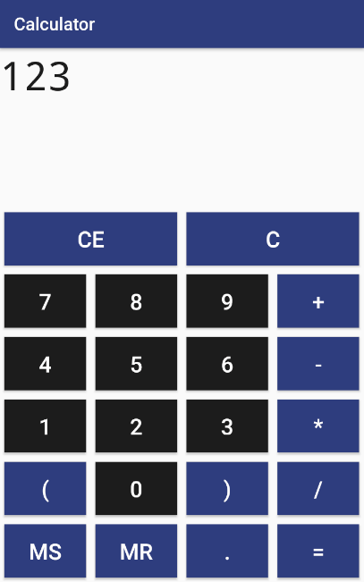
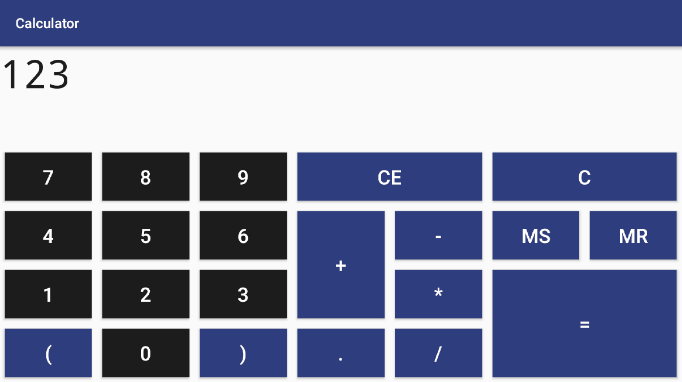

# Android Calculator App
An Android Calculator App, written in Java.

Features separate views for portrait and landscape orientation.
Supports decimals, memory features, and formula entry. 

To use formula entry, simply start with an open parenthesis. 
The calculator will automatically change into formula entry. 
Make sure to add a closed parenthesis! 

